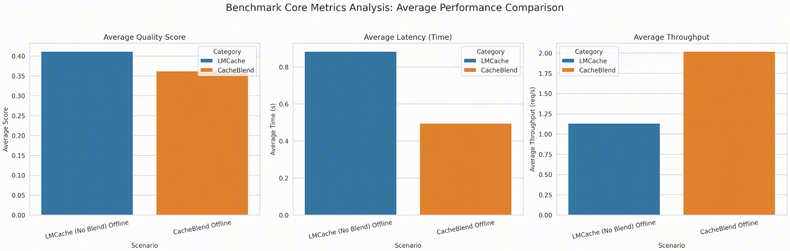

# Benchmarking LLM Performance: RAG Use Case

## Prerequisite: CacheBlend Bug Note
There is a known bug in **CacheBlend** within **LMCache version 0.3.7** which causes a **low cache hit rate**. This issue is scheduled to be fixed in the upcoming **0.3.9** release.
**In the meantime, please apply the following patch before proceeding:**
```bash
cd /workspace/LMCache
git apply -p /workspace/LMCache-Ascend/lmcache_ascend/v1/blend/cacheblend_patch.diff
```

## Overview
This repository provides benchmarking tools for evaluating the performance of Language Models (LLMs) on **LMCache v1** under various scenarios. It supports both **online and offline testing modes**.
The initial focus of this benchmark is the **RAG (Retrieval-augmented generation) use case**. The `rag.py` script simulates RAG workloads, enabling you to analyze the serving engine's **throughput and latency**.


### Comparison Baselines
The benchmark supports a direct comparison between two key LMCache features:
- **Prefix Cache** baseline.
- **CacheBlend** baseline.

### Current Workloads
**RAG Benchmark**: Simulates a real RAG dataset to evaluate key metrics such as token throughput, average time to first token, and average quality.

## Setup and Execution

### 1. Install Dependencies:
```bash
pip install -r requirements.txt
```

### 2. Launch the Serving Engine
The benchmark requires a serving engine running the **Qwen/Qwen3-8B** model at `http://localhost:8000/v1`.

| Feature Mode | Launch Command |
| :--- | :--- |
| **Standard vLLM** | `vllm serve Qwen/Qwen3-8B --disable-log-requests` |
| **LMCache + CacheBlend** | `LMCACHE_CONFIG_FILE=./config/lmcache_blending.yaml python3 -m lmcache_vllm.vllm.entrypoints.openai.api_server --model Qwen/Qwen3-8B --no-enable-prefix-caching --gpu-memory-utilization 0.8 --port 8000` |

### 3. Run the Benchmark
Use the provided scripts to launch the benchmark against the running engine:
* Run `./online.sh` or `./offline.sh` to benchmark **LMcache + Prefix Cache** or **LMcache + CacheBlend**.


#### Important Configuration and Pre-Computation

For the CacheBlend benchmark, the **`rag.py` script now automatically executes the KV Cache precomputation** into storage based on the specified settings.

Users must configure the following variables by **editing the `./online.sh` or `./offline.sh` script**:

* **END_INDEX**: Specifies the number of data points to process from the dataset.
* **Model Path** : The path or name of the language model to be tested.
* **Dataset Path** : The path to the RAG dataset file.

Additionally, ensure the following parameters are correctly set in the **LMCache configuration YAML file** (specified by `LMCACHE_CONFIG_FILE`):

* **`max_local_cpu_size`** must match the intended KV cache storage size.
* **`chunk_size`** must match the intended KV chunk size.


#### Analysis Script
The `analysis.py` script is used to **compare the benchmark results** for Prefix Cache and CacheBlend, and then **analyze and plot the data**.

### Arguments
#### Configure the workload
- `--dataset <str>` The path to the dataset. The format is described in `Dataset format` section.  
- `--start-index <int>` Start from which request in the dataset.
- `--end-index <int>` End before which request in the dataset. If not set, or set to negative value and has precomputation, it will default to the value returned by precompute according to how many requests' KV cache can be held in the given size.  
- `--shuffle` Random shuffle the dataset.  
- `--system-prompt <str>` System prompt before the documents.
- `--query-prompt <str>` Query prompt after the documents and before the question in dataset.
- `--separator <str>` The text used to separate system prompt, documents and query prompt. If enabling blending, should match the blend_separator. If not, should be "".
- `--prompt-build-method <str>` Should be QA or FEW_SHOT, indicating different tasks.
- `--time <int>` The number of seconds as an upper bound for this benchmark. By default no limit.
- `--step-interval <float>` The time interval benchmarking script steps for sending requests.
- `--max-tokens <int>` Maximum number of output tokens for every request.
- `--qps <float>` Query per second. The rate to send requests.
#### Configuring the serving engine connection
- `--model <str>` The model name used by the endpoint.
- `--base-url <str>` The URL endpoint for the language model server.
- `--api-key <str>` API key for the language model server.
#### Configure precompute
To benchmark CacheBlend, we need to precompute the KV cache of documents.  
- `--tokenizer <str>` The tokenizer name. If not provided, by default the same as `--model`.
- `--model-config <str>` The model config name. If not provided, by default the same as `--model`.
- `--kv-storage-size <str>` The size used for KV cache. This will decide how many requests will be sent, because we only precompute KV cache within this limit. The same as max_local_cache_size in LMCache config yaml.
- `--kv-chunk-size <int>` The same as chunk_size in LMCache config yaml.
- `--kv-precision-bit <int>` KV cache precision bit. By default 16 for FP16. Should be a multiple of 8.
#### Configure output
- `--output <str>` The csv file to dump the detailed stats for each query (default = summary.csv)
- `--verbose` Enable verbose logging.

## Benchmark Metrics

- **Throughput**: Request processed per second.  
- **Average TTFT (Time to First Token)**: Average time taken for the model to generate the first token of a response.
- **Average Quality**: Average quality score of generation content.  

## Benchmark Results

The benchmark was executed on **20 samples** of the `musique_s.json` RAG dataset.

CacheBlend Performance Summary：

| Metric | Prefix Cache (Baseline) | CacheBlend | Improvement |
| :--- | :--- | :--- | :--- |
| **Average Quality (Score)** | $0.4115$ | $0.3621$ | $\downarrow 12.0\%$ (Minor) |
| **End-to-End Latency(s)** | **$0.884$** | **$0.495$** | **$\downarrow 44\%$** |
| **Throughput (Req/s)** | $1.131$ | $2.020$ | **$\uparrow 78.6\%$** |



**Conclusion:** CacheBlend achieved a massive performance improvement, nearly **doubling the throughput** and reducing the **End-to-End Latency by $\approx 44\%$**. This substantial gain comes with a **minor trade-off** in average quality score ($12.0\%$ decrease, from $0.4115$ to $0.3621$), which is often acceptable for achieving such significant latency benefits in production serving.


## Dataset format
Should be a json file, which is a list of dicts.  
Every item(dict) in the list is one request with the following content.  
```
 {
        "ctxs": [
            {
                "title": "",
                "text": "doc_1"
            },
            {
                "title": "",
                "text": "doc_2"
            },
            {
                "title": "",
                "text": "doc_3"
            }
        ],
        "question": "xxx ?",
        "answers": [
            "yyy"
        ]
    }
```

An example is [CacheBlend musique_s.json](https://github.com/YaoJiayi/CacheBlend/blob/main/inputs/musique_s.json)
