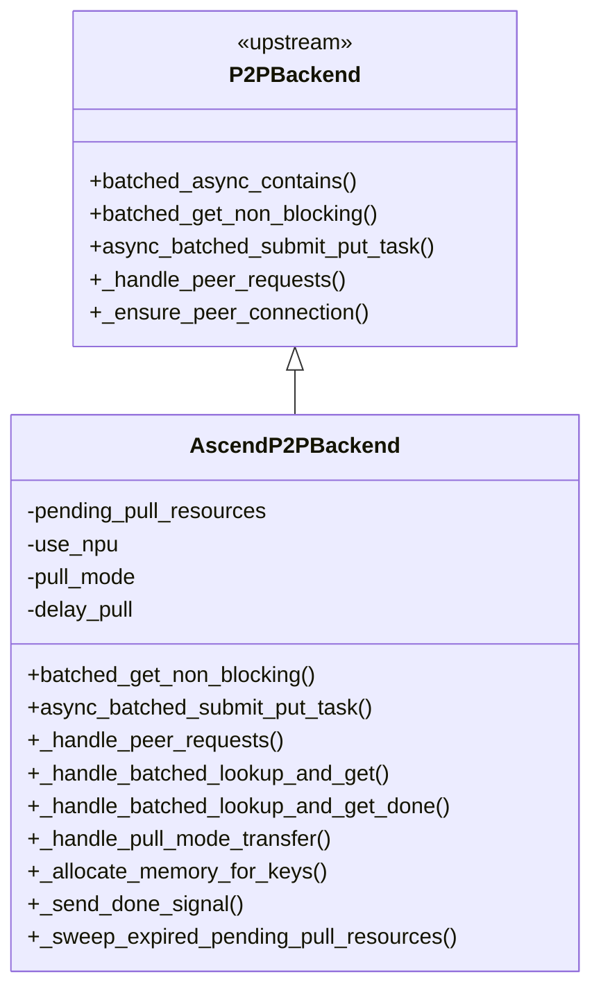
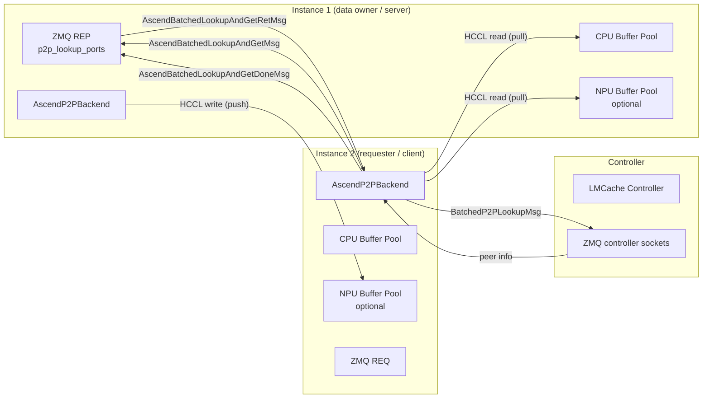
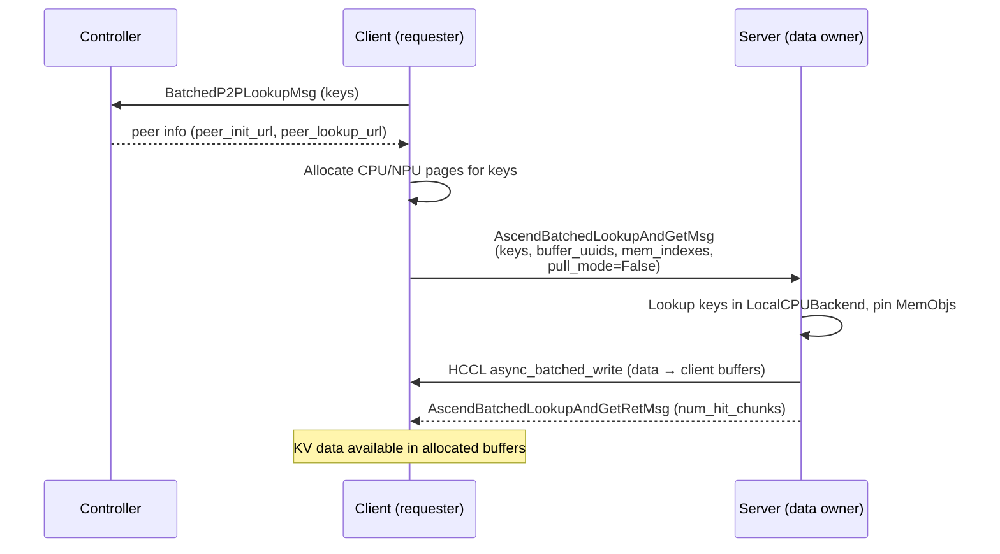
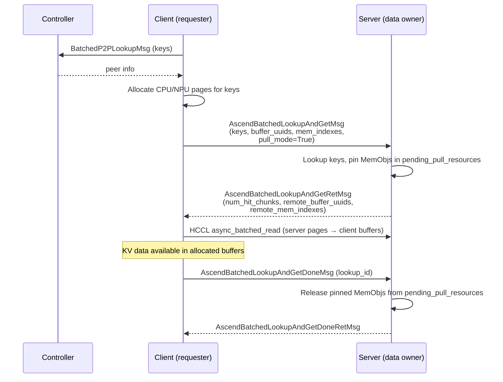
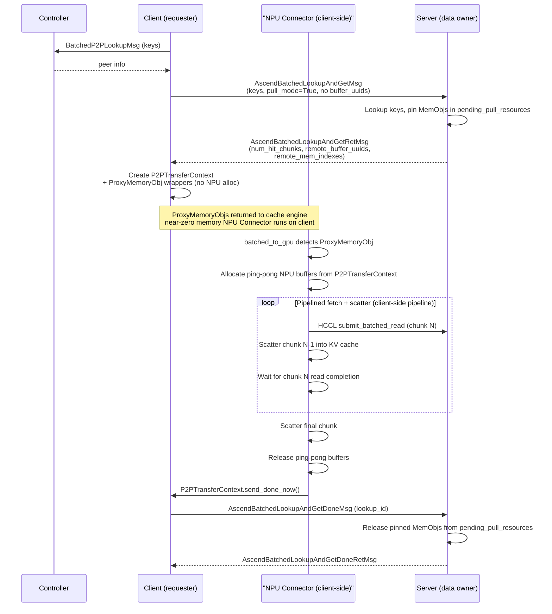

# AscendP2PBackend — Peer-to-Peer KV-Cache Sharing for Ascend NPUs

## 1. Overview

Peer-to-peer (P2P) KV-cache sharing lets multiple LMCache instances exchange
cached KV data directly, reusing prefill work across serving replicas.  The
upstream
[`P2PBackend`](../../../LMCache/lmcache/v1/storage_backend/p2p_backend.py)
implements the base protocol: controller-mediated lookup, ZMQ REQ/REP
control sockets, and a CPU-only transfer path.

`AscendP2PBackend` extends `P2PBackend` with Ascend-specific capabilities:

- **HCCL transfer channel** — RDMA transport layer for Ascend NPUs,
  registered with both CPU and NPU buffers simultaneously.
- **Optional NPU buffer pool** — an additional `p2p_npu_buffer_size`
  allocation on-device, used as staging memory for HCCL transfers.
- **UUID-based buffer references** — buffers are addressed by UUID rather
  than raw integer page indexes, enabling safe cross-node HCCL addressing.
- **Three transfer modes** — push (default), pull-eager, and pull-delay
  (deferred fetch with `ProxyMemoryObj`).
- **Done signal with TTL sweep** — `AscendBatchedLookupAndGetDoneMsg` lets
  the client notify the server that pinned resources are safe to release.  A
  background coroutine sweeps entries whose TTL has expired, protecting
  against peer crashes.
- **Retry logic** — configurable `p2p_max_retry_count` with automatic peer
  reconnection on ZMQ errors.

## 2. Architecture

### Class Hierarchy



### Component Diagram



## 3. Ascend-Specific Configuration Reference

The following parameters are added by `_patch_config()` in
[`lmcache_ascend/__init__.py`](../lmcache_ascend/__init__.py).
For base P2P parameters (`enable_p2p`, `p2p_host`, `p2p_init_ports`,
`p2p_lookup_ports`, `transfer_channel`), see the upstream LMCache
documentation.

### `p2p_use_npu`

| | |
|---|---|
| **Type** | `bool` |
| **Default** | `False` |

Enables an NPU memory buffer for P2P transfers.  When `False`, all data is
staged through the CPU buffer inherited from `LocalCPUBackend`.  When `True`,
a separate NPU buffer pool of size `p2p_npu_buffer_size` is created and
registered with the HCCL channel alongside the CPU buffer.

### `p2p_npu_buffer_size`

| | |
|---|---|
| **Type** | `int` (bytes) |
| **Default** | `1073741824` (1 GB) |
| **Requires** | `p2p_use_npu=True` |

Size of the NPU buffer pool.  In delay-pull mode this pool is divided into
a ping-pong pair of scratch buffers used by the NPU connector.  The pool
size determines the maximum `max_pipeline_depth` — how many KV chunks can
be in-flight simultaneously.  Notice that with `p2p_delay_pull=True` this
value can be much smaller than the total KV-cache size (e.g. 128 MB serves
as a rolling window).

### `p2p_pull_mode`

| | |
|---|---|
| **Type** | `bool` |
| **Default** | `False` |
| **Requires** | `p2p_use_npu=True` |

Enables receiver-initiated (pull) transfers.  When `False` (default), push
mode is used: the server reads from its local CPU backend and writes data
directly to the client's pre-allocated buffers via HCCL.  When `True`, the
server pins its local MemObjs and returns UUID-based references; the client
then reads the data on-demand.

### `p2p_delay_pull`

| | |
|---|---|
| **Type** | `bool` |
| **Default** | `False` |
| **Requires** | `p2p_pull_mode=True`, `p2p_use_npu=True` |

Defers the actual RDMA read until the NPU connector calls `batched_to_gpu`.
The client creates lightweight `ProxyMemoryObj` wrappers instead of
pre-allocating NPU pages.  A `P2PTransferContext` manages the ping-pong
buffer pool and sends the Done signal once all proxies in a batch are
consumed.

## 4. Transfer Mode Sequence Diagrams

### Push Mode (default)



### Pull — Eager Mode (`p2p_pull_mode=True`, `p2p_delay_pull=False`)



### Pull — Delay Mode (`p2p_pull_mode=True`, `p2p_delay_pull=True`)



## 5. Memory Allocation Strategy

`AscendP2PBackend` manages up to two buffer pools registered with the HCCL
channel.

### Buffer Initialisation

On construction, the following buffers are registered with
`CreateTransferChannel()`:

- **CPU buffer** — always present, sourced from `LocalCPUBackend`'s
  `PagedCpuGpuMemoryAllocator`.  Provides the fallback staging area when
  `p2p_use_npu=False`.
- **NPU buffer** — created when `p2p_use_npu=True`.  Size is
  `p2p_npu_buffer_size` (default 1 GB), aligned to the CPU allocator's
  `align_bytes`.  Registered alongside the CPU buffer as a second HCCL
  buffer entry.

Both buffers are identified by UUID, enabling the transfer channel to route
RDMA operations to the correct memory region.

### `_allocate_memory_for_keys()`

Per-key allocation before a push or pull-eager transfer:

| Condition | Allocator Used |
|-----------|----------------|
| `p2p_use_npu=True` | NPU (`memory_allocator.gpu_allocator`) |
| `p2p_use_npu=False` | CPU (`local_cpu_backend.allocate()`) |

If any allocation fails (out of memory), all previously allocated objects for
that request are released immediately and an empty result is returned.

### Delay-Pull

When `p2p_delay_pull=True`, `_allocate_memory_for_keys()` is skipped
entirely.  `P2PTransferContext.allocate_buffers()` is called on-demand by
the NPU connector to obtain ping-pong scratch buffers.  The maximum
in-flight chunk count (`max_pipeline_depth`) is derived from the NPU buffer
size divided by twice the per-chunk page size.

## 6. Comparison: Upstream P2PBackend vs AscendP2PBackend

- **Memory support** — upstream uses CPU memory only via `LocalCPUBackend`;
  `AscendP2PBackend` optionally adds an NPU buffer pool registered with the
  HCCL channel.

- **Buffer addressing** — upstream uses raw `mem_indexes`; `AscendP2PBackend`
  uses UUID-based `buffer_uuids` that identify which registered buffer
  (CPU or NPU) a page belongs to.

- **Transfer modes** — upstream supports push mode only (server writes to
  client buffers); `AscendP2PBackend` adds pull-eager (client reads
  immediately) and pull-delay (deferred fetch via `ProxyMemoryObj`).

- **Transfer channel** — upstream uses GPU/NCCL-based channels;
  `AscendP2PBackend` uses an HCCL channel with multi-buffer registration
  (CPU + NPU), enabling RDMA from either memory type.

- **Done signal** — upstream has no explicit resource-release mechanism;
  `AscendP2PBackend` adds `AscendBatchedLookupAndGetDoneMsg` so the client
  notifies the server when it has finished consuming pinned MemObjs.

- **TTL sweep** — upstream has no equivalent; `AscendP2PBackend` runs
  `_sweep_expired_pending_pull_resources()` every 10 s, releasing entries
  whose TTL (`p2p_pull_pending_ttl`, default 360 s) has expired, protecting
  against memory leaks if a client crashes mid-pull.

- **Retry logic** — upstream has basic error handling; `AscendP2PBackend`
  adds `_send_lookup_request_with_retry()` with up to `p2p_max_retry_count`
  (default 3) retries and automatic peer reconnection on ZMQ errors.

- **Deferred fetch** — upstream has no equivalent; `AscendP2PBackend`
  introduces `ProxyMemoryObj` and `P2PTransferContext` for pipelined
  on-demand fetching during `batched_to_gpu`.

## 7. Discussion: Benefits and Limitations

### Push Mode

**Benefits:** Simplest flow; server does all data movement, so the client
needs no RDMA read capability.  No pinned state on the server after the
write completes.

**Limitations:** Client must pre-allocate CPU or NPU pages before sending the
request.  The server blocks its event loop during the HCCL write, which can
add latency for concurrent requests.

### Pull — Eager Mode

**Benefits:** Client controls when the HCCL read happens, allowing better
scheduling.  Server releases pinned resources promptly after the Done signal,
improving server buffer utilisation.

**Limitations:** Client must still pre-allocate CPU or NPU pages before
sending the request.  The round-trip (request → server pin → client read →
Done) adds one extra message exchange compared to push mode.

### Pull — Delay Mode

**Benefits:** Lowest client NPU memory footprint — `ProxyMemoryObj` creation
is near-instant and uses zero NPU pages.  The cache engine can return
proxies immediately, unblocking the scheduling loop.  Pipelined ping-pong
in the NPU connector overlaps RDMA reads with KV-cache scatter, amortising
transfer latency.

**Limitations:** RDMA reads happen on the critical path inside
`batched_to_gpu`, adding transfer latency to the token generation step.
Server MemObjs remain pinned longer (until the Done signal is sent after all
proxies are consumed), increasing server memory pressure under high load.
Requires careful sizing of `p2p_npu_buffer_size` for the ping-pong pool.

### TTL Sweep

**Benefits:** Prevents indefinite memory leaks on the server if a client
crashes or becomes unreachable mid-pull without sending the Done signal.

**Limitations:** The default TTL of 360 s is a coarse safety net.  Resources
from a crashed peer remain pinned for up to 360 s, which may be unacceptable
under heavy buffer pressure.  Conversely, setting TTL too short risks
prematurely releasing resources for slow but live clients.

## 8. Example YAML Configs

### Instance 1 — Pull-Delay with NPU Buffer

From
[`examples/kv_cache_reuse/share_across_instances/p2p_sharing/example1.yaml`](../examples/kv_cache_reuse/share_across_instances/p2p_sharing/example1.yaml):

```yaml
chunk_size: 256
local_cpu: True
max_local_cpu_size: 5
enable_async_loading: True

# P2P configurations
enable_p2p: True
p2p_host: "<hostIP>"
p2p_init_ports: [9960, 9961]
p2p_lookup_ports: [9962, 9963]
transfer_channel: "hccl"
p2p_use_npu: True
p2p_pull_mode: True
p2p_delay_pull: True
# 128MB — notice the 128MB is much smaller than the actual required KV-cache tokens size
p2p_npu_buffer_size: 134217728

# Controller configurations
enable_controller: True
lmcache_instance_id: "lmcache_instance_1"
controller_pull_url: "<hostIP>:9800"
controller_reply_url: "<hostIP>:9900"
lmcache_worker_ports: [9950, 9951]

extra_config:
  lookup_backoff_time: 0.001
```

Key points:
- `p2p_use_npu` + `p2p_pull_mode` + `p2p_delay_pull` enable the delay-pull
  path with NPU staging.
- `p2p_npu_buffer_size` (128 MB) is the ping-pong pool for pipelined RDMA
  reads; it does not need to hold all in-flight KV data at once.
- `p2p_init_ports` and `p2p_lookup_ports` each require one port per TP rank.
- `lmcache_instance_id` identifies this instance to the controller.

### Instance 2 — CPU-Only Push Mode (No NPU)

From
[`examples/kv_cache_reuse/share_across_instances/p2p_sharing/example2.yaml`](../examples/kv_cache_reuse/share_across_instances/p2p_sharing/example2.yaml):

```yaml
chunk_size: 256
local_cpu: True
max_local_cpu_size: 5
enable_async_loading: True

# P2P configurations
enable_p2p: True
p2p_host: "<hostIP>"
p2p_init_ports: [9964, 9965]
p2p_lookup_ports: [9966, 9967]
transfer_channel: "hccl"

# Controller configurations
enable_controller: True
lmcache_instance_id: "lmcache_instance_2"
controller_pull_url: "<hostIP>:8600"
controller_reply_url: "<hostIP>:8700"
lmcache_worker_ports: [9952, 9953]

extra_config:
  lookup_backoff_time: 0.001
```

Key points:
- No `p2p_use_npu`, `p2p_pull_mode`, or `p2p_delay_pull` — this instance
  operates in push mode with CPU-only staging.
- A different `lmcache_instance_id` (`lmcache_instance_2`) distinguishes
  it from Instance 1 in the controller's peer registry.
- `p2p_init_ports` and `p2p_lookup_ports` use a different port range to
  avoid collisions with Instance 1 when both run on the same host.
