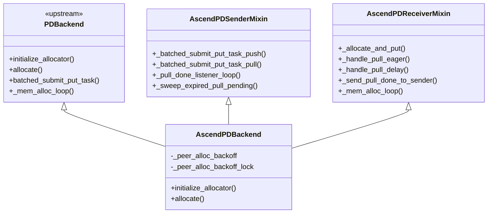
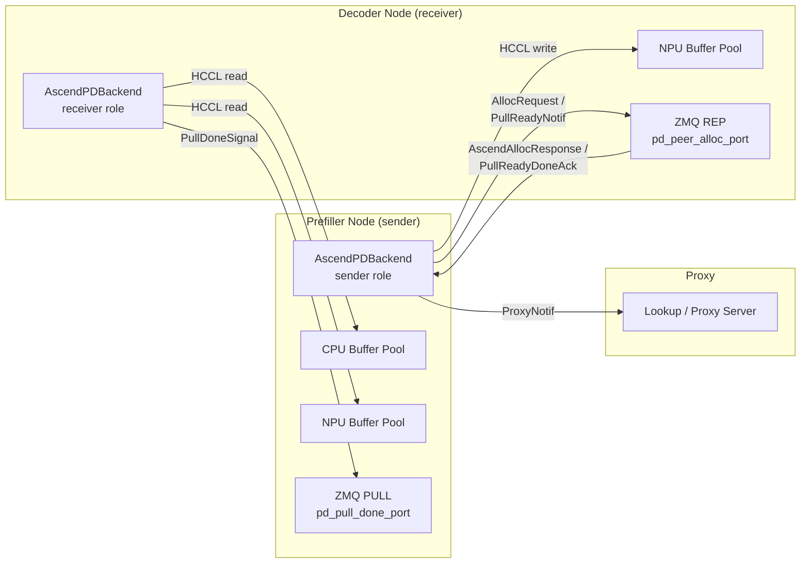
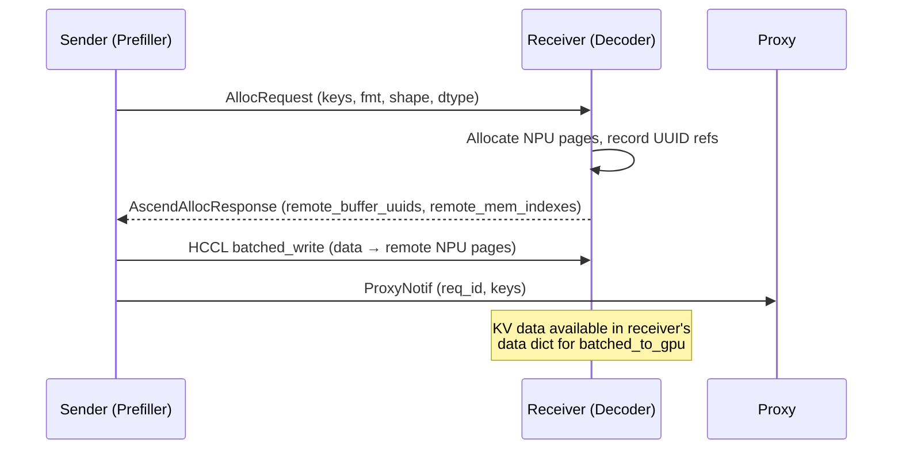
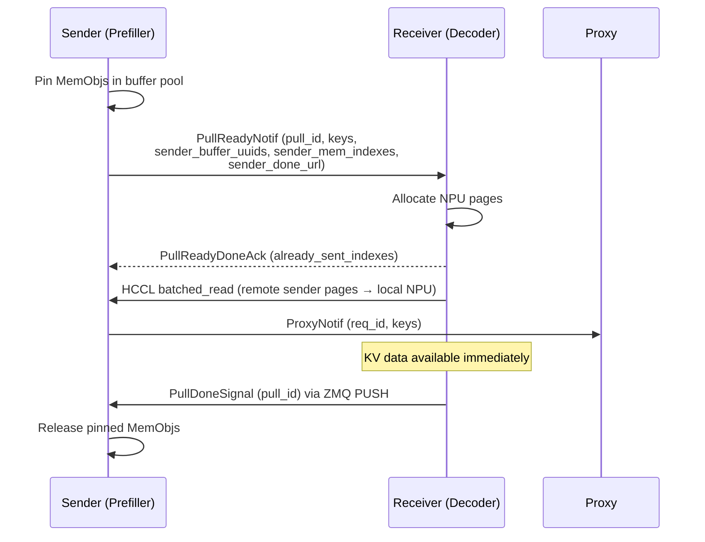
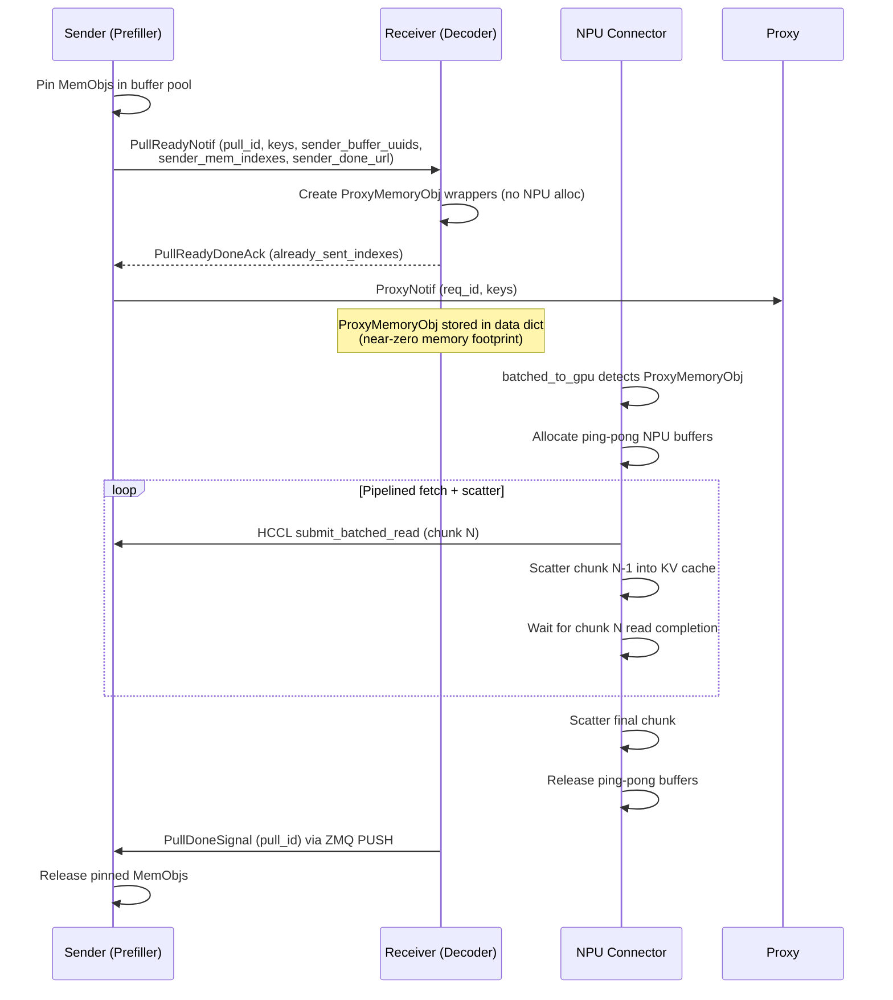

# AscendPDBackend — PD Disaggregated KV-Cache Transfer for Ascend NPUs

## 1. Overview

In prefill-decode (PD) disaggregated serving, prefill workers compute
KV caches while decode workers consume them.  The upstream
[`PDBackend`](../../../LMCache/lmcache/v1/storage_backend/pd_backend.py)
implements the base transfer protocol using GPU memory and NCCL/RDMA channels.

`AscendPDBackend` extends `PDBackend` with Ascend-specific capabilities:

- **HCCL transfer channel** — RDMA transport layer for Ascend NPUs, replacing NCCL.
- **Dual CPU + NPU memory allocators** — separate buffer pools that enable
  sender-side CPU offload while receivers pre-allocate on NPU.
- **UUID-based buffer references** — buffers are addressed by UUID rather than
  raw integer indexes, which allows safe cross-node addressing across HCCL
  registered memory regions.
- **Three transfer modes** — push (default), pull-eager, and pull-delay
  (deferred fetch with `ProxyMemoryObj`).
- **Circuit breaker** — per-peer backoff that skips transfers to receivers
  whose allocation has recently failed, preventing wasted network I/O.
- **ZMQ side-channels** — lightweight `PullDoneSignal` sockets so receivers
  can notify senders that pinned buffers are safe to release.

## 2. Architecture

### Class Hierarchy



### Component Diagram



## 3. Ascend-Specific Configuration Reference

The following parameters are added by `_patch_config()` in
[`lmcache_ascend/__init__.py`](../lmcache_ascend/__init__.py).
For base PD parameters (`pd_role`, `pd_buffer_size`, `pd_buffer_device`,
`pd_peer_host`, `pd_peer_init_port`, `pd_peer_alloc_port`, `pd_proxy_host`,
`pd_proxy_port`), see the upstream LMCache documentation.

### `pd_pull_mode`

| | |
|---|---|
| **Type** | `bool` |
| **Default** | `False` |
| **Side** | Both (sender and receiver must agree) |

Enables receiver-initiated RDMA reads.  When `False` (default), push mode is
used: the sender writes KV data into receiver-allocated NPU memory.
When `True`, the sender advertises buffer references and the receiver reads
the data on-demand.

### `pd_delay_pull`

| | |
|---|---|
| **Type** | `bool` |
| **Default** | `False` |
| **Requires** | `pd_pull_mode=True`, `pd_buffer_device="npu"` |
| **Side** | Receiver |

Defers the actual RDMA read until `batched_to_gpu` is called by the NPU
connector.  The receiver creates lightweight `ProxyMemoryObj` wrappers instead
of pre-allocating NPU pages.  Data is fetched using a pipelined ping-pong
approach that overlaps RDMA reads with KV-cache scatter.

### `pd_pull_done_port`

| | |
|---|---|
| **Type** | `list[int]` |
| **Default** | `None` (falls back to `pd_peer_alloc_port + 100`) |
| **Side** | Sender |

Per-TP-rank ZMQ ports on which the sender binds a PULL socket to receive
`PullDoneSignal` messages from the receiver.  Must have one port per
tensor-parallel rank.

### `pd_use_cpu_offload`

| | |
|---|---|
| **Type** | `bool` |
| **Default** | `False` |
| **Requires** | `pd_pull_mode=True`, sender role |
| **Side** | Sender |

Offloads KV caches from NPU to CPU on the sender before the RDMA transfer.
This frees sender NPU memory earlier but adds an NPU-to-CPU copy and requires
a larger CPU buffer (see `pd_cpu_buffer_size`).

### `pd_cpu_buffer_size`

| | |
|---|---|
| **Type** | `int` (bytes) |
| **Default** | `None` (falls back to `pd_buffer_size`) |
| **Requires** | `pd_use_cpu_offload=True` |
| **Side** | Sender |

Size of the CPU buffer pool used for sender-side CPU offload.  Should be large
enough to hold the maximum number of concurrently pinned KV chunks.

### `pd_alloc_fail_backoff_ttl`

| | |
|---|---|
| **Type** | `float` (seconds) |
| **Default** | `2.0` |
| **Side** | Sender |

TTL window in seconds for the per-peer circuit breaker.  When a receiver
reports an allocation failure, the sender skips all transfers to that peer
for this duration to avoid wasted network I/O.  After the TTL expires the
sender resumes normal transfers.

### `pd_pull_pending_ttl`

| | |
|---|---|
| **Type** | `float` (seconds) |
| **Default** | `360.0` |
| **Requires** | `pd_pull_mode=True` |
| **Side** | Sender |

Safety-net TTL for pull-pending entries on the sender.  When a receiver
crashes or becomes unreachable mid-pull and never sends `PullDoneSignal`,
the sender releases pinned `MemObj`s after this timeout to prevent memory
leaks.

### `pd_pull_backpressure_reserve_pct`

| | |
|---|---|
| **Type** | `float` (percent) |
| **Default** | `2.0` |
| **Requires** | `pd_pull_mode=True` |
| **Side** | Sender |

Percentage of the sender's buffer pool reserved as free headroom in pull
mode.  New put tasks block (backpressure) when the number of pinned pages
exceeds `(1 - reserve_pct/100) * total_pages`.  Prevents slow receivers
from exhausting the sender's buffer pool.

## 4. Transfer Mode Sequence Diagrams

### Push Mode (default)



### Pull — Eager Mode (`pd_pull_mode=True`, `pd_delay_pull=False`)



### Pull — Delay Mode (`pd_pull_mode=True`, `pd_delay_pull=True`)



## 5. Memory Allocation Strategy

`AscendPDBackend` overrides `initialize_allocator()` and `allocate()` to
manage both NPU and CPU buffer pools.

### `initialize_allocator()`

Called once during backend construction.  Creates up to two allocators inside a
single `PagedCpuGpuMemoryAllocator`:

- **NPU allocator** — created when `pd_buffer_device` starts with `"npu"`.
  Size is `pd_buffer_size`.
- **CPU allocator** — created when `pd_buffer_device == "cpu"` *or*
  `pd_use_cpu_offload` is enabled.  Size is `pd_cpu_buffer_size` (falls
  back to `pd_buffer_size` if not set).

Both buffers are registered with the HCCL channel so that either can be the
source or destination of an RDMA transfer.

### `allocate()`

Role-aware page allocation:

| Role | Condition | Allocator Used |
|------|-----------|----------------|
| Sender | `pd_use_cpu_offload=True` | CPU |
| Sender | `pd_use_cpu_offload=False` | NPU |
| Receiver | — | NPU |

For receivers in delay-pull mode, `allocate()` is not called at allocation
time; `ProxyMemoryObj` wrappers are created instead and NPU pages are
allocated later by the ping-pong pipeline inside `batched_to_gpu`.

## 6. Comparison: Upstream PDBackend vs AscendPDBackend

- **Memory allocator** — upstream creates a single GPU allocator;
  AscendPDBackend supports dual CPU + NPU allocators for sender-side
  offload.

- **Buffer addressing** — upstream uses raw integer page indexes;
  AscendPDBackend uses UUID-based buffer references
  (`remote_buffer_uuids`) that are stable across HCCL registered memory
  regions.

- **Transfer modes** — upstream supports push mode only; AscendPDBackend
  adds pull-eager and pull-delay (deferred fetch via `ProxyMemoryObj`).

- **Transfer channel** — upstream uses NCCL / GPU-based channels;
  AscendPDBackend uses an HCCL channel with multi-buffer registration
  (CPU + NPU).

- **Circuit breaker** — not present in upstream; AscendPDBackend adds
  per-peer TTL-based backoff (`pd_alloc_fail_backoff_ttl`, default 2 s)
  that skips transfers to receivers whose allocation has recently failed.

- **Deferred fetch** — upstream has no equivalent of `ProxyMemoryObj`;
  AscendPDBackend introduces it so that receivers can defer RDMA reads
  until `batched_to_gpu`, reducing peak NPU memory on the receiver.

- **Done signal** — upstream does not have an explicit done-signal
  mechanism for buffer release; AscendPDBackend adds a ZMQ-based
  `PullDoneSignal` protocol so that senders release pinned buffers only
  after the receiver has finished consuming the data.

## 7. Discussion: Benefits and Limitations

### Push Mode

**Benefits:** Simplest flow; lowest per-token overhead during decode (TPOT)
because data is already resident on receiver NPU when `batched_to_gpu` runs.

**Limitations:** Requires large pre-allocated NPU buffer on the receiver to
hold incoming KV caches.  The sender blocks during the HCCL write, occupying
its own buffer pages until the transfer completes.

### Pull — Eager Mode

**Benefits:** Receiver controls when reads happen, enabling better scheduling.
Sender buffers are released promptly after the `PullDoneSignal`, which
improves sender buffer utilisation.

**Limitations:** Still requires NPU pre-allocation on the receiver (pages are
allocated before the read).  The receiver must perform the HCCL read before
data is available, adding latency compared to push mode.

### Pull — Delay Mode

**Benefits:** Lowest NPU memory on the receiver — `ProxyMemoryObj` creation
is near-instant and uses zero NPU pages.  TTFT (time to first token) is
faster because proxy creation returns immediately, unblocking the scheduling
loop.  Pipelined ping-pong overlaps RDMA reads with KV-cache scatter,
amortising transfer latency.

**Limitations:** Higher TPOT because RDMA reads happen on the critical decode
path (`batched_to_gpu`).  Sender buffers remain pinned longer (until the
receiver sends `PullDoneSignal` after scatter), increasing sender memory
pressure.  Requires careful sizing of ping-pong buffers.

### CPU Offload (`pd_use_cpu_offload`)

**Benefits:** Frees sender NPU memory earlier by copying KV data to CPU
before the RDMA transfer.  RDMA can then proceed from CPU memory, allowing
the NPU to be used for new prefill work.

**Limitations:** Adds an NPU-to-CPU copy on the sender.  Requires a
sufficiently large CPU buffer (`pd_cpu_buffer_size`).  Only applicable to
pull modes (the receiver reads from the sender's CPU buffer).

### Circuit Breaker

**Benefits:** Protects the sender buffer pool from slow or failing receivers
by skipping transfers for a configurable TTL window
(`pd_alloc_fail_backoff_ttl`, default 2 s).

**Limitations:** Introduces skip/retry latency under contention — requests to
a backed-off receiver are silently dropped until the backoff expires.

## 8. Example YAML Configs

### Sender (Prefiller) — Pull-Delay with CPU Offload

From
[`examples/disagg_prefill/1p1d/configs/lmcache-prefiller-config.yaml`](../examples/disagg_prefill/1p1d/configs/lmcache-prefiller-config.yaml):

```yaml
local_cpu: False

enable_pd: True
transfer_channel: "hccl"
pd_role: "sender"
pd_pull_mode: True
pd_delay_pull: True
pd_pull_done_port: [7600, 7601]
pd_use_cpu_offload: True
pd_cpu_buffer_size: 21474836480   # 20 GB
pd_peer_host: "<hostIP>"
pd_proxy_host: "<hostIP>"
pd_proxy_port: 8500
pd_buffer_size: 32225472          # ~32 MB (NPU-side, small because offload is enabled)
pd_buffer_device: "npu"
```

Key points:
- `pd_pull_mode` + `pd_delay_pull` enable the delay-pull path.
- `pd_use_cpu_offload` + `pd_cpu_buffer_size` configure the CPU buffer for
  offloading KV caches before RDMA reads.
- `pd_pull_done_port` specifies two ports (one per TP rank) for receiving
  `PullDoneSignal` messages.
- `pd_buffer_size` is intentionally small on NPU because the bulk of the data
  sits in the CPU buffer.

### Receiver (Decoder) — Minimal NPU Buffering

From
[`examples/disagg_prefill/1p1d/configs/lmcache-decoder-config.yaml`](../examples/disagg_prefill/1p1d/configs/lmcache-decoder-config.yaml):

```yaml
local_cpu: False

enable_pd: True
transfer_channel: "hccl"
pd_role: "receiver"
pd_peer_host: "<hostIP>"
pd_pull_mode: True
pd_delay_pull: True # Enable delayed pulling of data from the peer
pd_peer_init_port: [7300, 7301] #7300 # Need to have 1 for each TP instance
pd_peer_alloc_port: [7400, 7401]   #7400 # Need to have 1 for each TP instance
# 128MB — notice the 128MB is much smaller than the actual required KV-cache tokens size
pd_buffer_size: 134217728 # Size of the buffer for prefetching data from the peer (in bytes)
pd_buffer_device: "npu" # Use npu memory for buffering
```

Key points:
- `pd_pull_mode` + `pd_delay_pull` on the receiver enable the delay-pull path,
  matching the sender configuration (NPU Only).
- `pd_buffer_size` (128 MB here) serves as the ping-pong pool for pipelined
  RDMA reads during `batched_to_gpu`; it does not need to hold all in-flight
  KV data at once.
- `pd_peer_init_port` and `pd_peer_alloc_port` each need one port per TP rank.
