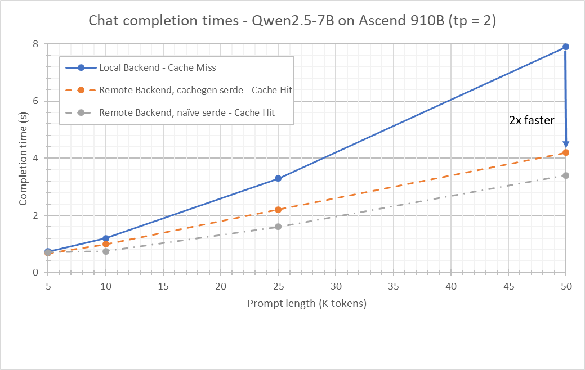
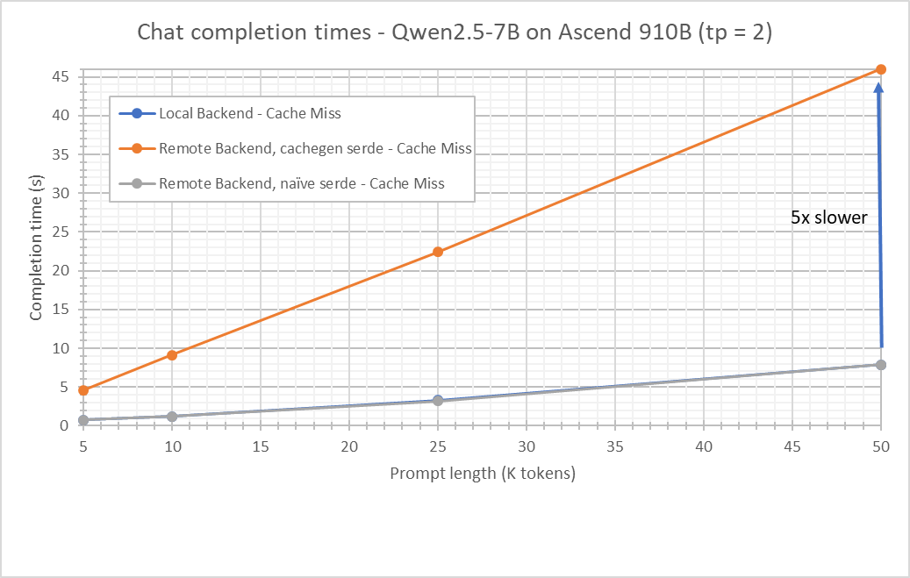

# Cachegen

[The Cachegen paper (link)](https://dl.acm.org/doi/10.1145/3651890.3672274) is about compressing KV caches for streaming. From the paper it, very broadly, has 2 aspects:

1. Quantizing the cache - take inter-token deltas in the K/V tensors with anchors and quantize that to a lower precision
2. Use arithmetic encoding to convert the quantized symbols to a bitstream

(There are other aspects such as adaptive streaming that we're putting to one side here)

Cachegen per LMCache's implementation is a simplified chunkwise quantization + arithmetic encoder. ([Issue (link)](https://github.com/LMCache/LMCache/issues/1841) highlighting the difference between paper and realization)

## Current state

The initial implementation of Cachegen in LMCache-Ascend inherits the simplified quantization (it's implemented in python in LMCache) and adds its own kernels for arithmetic encoding. For performance reasons, the details of that arithmetic encoder have deviated from the CUDA implementation - it trades a bit of compression efficacy for performance (details later).

The graph shows completion times with a remote backend (with cache hits in the remote). The remote backend is LMCache server which stores cache in CPU. With Ascend Cachegen serde the completion time is 2x faster compared to recomputing the cache. Naive serde is slightly faster again (~20%) but occupies 3.5x as much cache. When the remote storage is precious (such as an in-memory redis remote) Ascend Cachegen is an attractive option. The bottleneck with naive serde is transmission time, with cachegen it is decoding bitstream.

There is a drawback - encode costs:

The graph shows completion times with a remote backend in the cache miss scenario. While naive serde performance is essentially the same as with a local backend, cachegen incurs a significant slowdown. The bottleneck is a `RepeatInterleave` kernel invoked from the `CacheGenEncoderImpl` in LMCache. The initial scope of cachegen focuses on the kernels rather than updating the LMCache scaffolding. This limitation will be addressed in the future.

Reinforcing that, the above is an excerpt from a profile of encode - the new kernels can be seen on the left while the repeat interleave is on the right.

### Details of the encoder

The reference cachegen implementation implements a pure form of an arithmetic encoder. For Ascend the two key implementation problems are:

- The algorithm is regressive and carries state from one symbol to the next which doesn't naturally vectorize
- To match the range calculations of the reference implementation would require types not supported by the AscendC vector interfaces

Instead our implementation aligns the CDF boundaries to powers of 2. Thus, a given symbol is always encoded as the same bit sequence. Done optimally it becomes a variant of Huffman encoding, although owing to a detail of the alignment we're not at that ideal.

The current implementation is still not optimal - particularly in decode the step of determining which symbol is present leans on the scalar core and, as a consequence, the overall kernel is scalar bound.

## Issues and Limitations

There are several issues:

- Encode is bottlenecked on a particular kernel (RepeatInterleave) invoked by LMCache. The work it is being invoked to do needn't be so expensive, but resolving it needs more invasive changes as the root cause is from a higher layer in the stack
- Even with our Ascend specialized variant, decode is still slow relative to completion. Primarily this is because much of the computation happens on the scalar core
- When using remote backend the encode is not async so the slow cachegen encode is "felt" as a slow completion endpoint in cache-miss scenarios
- When the compress/decompress endpoint is hit, the memory is allocated from the headroom which can result in out of memory issues
- There are preexisting but benign issues in the reference counting of memory objects in the serializer ["Double Free / Negative Ref Count when using cachegen serializer on AMD ROCm LMCache #2409"](https://github.com/LMCache/LMCache/issues/2409)
- To be a win, the encode/decode kernels use 20 AIVs consuming resources that could otherwise be allocated to other tasks
